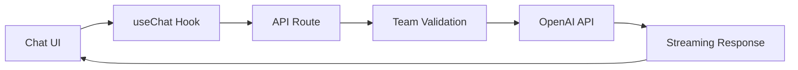

Init includes a built-in AI chat system powered by OpenAI and the Vercel AI SDK. This guide covers the implementation details, customization options, and best practices for AI features.

## Overview

The AI system provides:

- **Real-time streaming** - Responses stream in real-time as they're generated
- **Team-scoped chat** - Each team has its own AI chat context
- **Modern UI** - Clean chat interface with message history
- **Error handling** - Graceful error handling and user feedback
- **Extensible design** - Easy to customize and extend

## Architecture



## Core Components

### 1. API Route (`/api/chat`)

The API route handles chat requests:

```typescript
// apps/web/src/app/api/chat/route.ts
import type { Message } from "ai";
import { openai } from "@ai-sdk/openai";
import { streamText } from "ai";

import { caller } from "@/trpc/server";

export const maxDuration = 30;

export async function POST(request: Request) {
  const { messages, slug } = (await request.json()) as {
    messages: Message[];
    slug: string;
  };

  // Ensure the team exists and the user has access to it
  await caller.team.getTeam({ slug: slug });

  const result = streamText({
    model: openai("gpt-4o-mini"),
    messages,
  });

  return result.toDataStreamResponse({
    getErrorMessage: (error) => {
      console.error(error);
      return "An error occurred while processing the messages";
    },
  });
}
```

### 2. Chat Form Component

The main chat interface:

```typescript
// apps/web/src/app/(dashboard)/dashboard/[slug]/(home)/_components/ai-chat-form.tsx
"use client";

import { useChat } from "@ai-sdk/react";
import { Button } from "@repo/ui/components/button";
import { toast } from "@repo/ui/components/sonner";

export type AIFormProps = {
  slug: string;
};

export const AIChatForm = ({ slug }: AIFormProps) => {
  const { messages, append, status, stop, input, setInput } = useChat({
    api: "/api/chat",
    body: { slug },
    onError: (error) => {
      toast.error(`An error occurred: ${error.message}`);
    },
  });

  const handleSubmit = (e: React.FormEvent) => {
    e.preventDefault();
    if (input.trim()) {
      append({ role: "user", content: input });
    }
  };

  return (
    <div className="flex flex-col h-full">
      {/* Messages Container */}
      <MessagesContainer className="flex-1 overflow-y-auto">
        {messages.map((message) => (
          <Message key={message.id} message={message} />
        ))}
      </MessagesContainer>

      {/* Input Form */}
      <form onSubmit={handleSubmit} className="p-4 border-t">
        <PromptInput>
          <PromptInputTextarea
            value={input}
            onChange={(e) => setInput(e.target.value)}
            placeholder="Ask me anything..."
            disabled={status === "in_progress"}
          />
          <PromptInputActions>
            {status === "in_progress" ? (
              <Button
                type="button"
                onClick={stop}
                size="icon"
                variant="ghost"
              >
                <Square className="h-4 w-4" />
              </Button>
            ) : (
              <Button
                type="submit"
                size="icon"
                disabled={!input.trim()}
              >
                <ArrowUp className="h-4 w-4" />
              </Button>
            )}
          </PromptInputActions>
        </PromptInput>
      </form>
    </div>
  );
};
```

### 3. Message Components

Reusable message display components:

```typescript
// apps/web/src/app/(dashboard)/dashboard/[slug]/(home)/_components/ai-chat-message.tsx
import type { Message as AIMessage } from "ai";
import { Avatar } from "@repo/ui/components/avatar";
import { cn } from "@repo/ui/lib/utils";

interface MessageProps {
  message: AIMessage;
}

export const Message = ({ message }: MessageProps) => {
  const isUser = message.role === "user";

  return (
    <div
      className={cn(
        "flex gap-3 p-4",
        isUser ? "flex-row-reverse" : "flex-row"
      )}
    >
      <MessageAvatar role={message.role} />
      <MessageContent
        content={message.content}
        isUser={isUser}
      />
    </div>
  );
};

export const MessageAvatar = ({ role }: { role: string }) => {
  return (
    <Avatar className="h-8 w-8">
      {role === "user" ? (
        <span className="text-sm font-medium">U</span>
      ) : (
        <span className="text-sm font-medium">AI</span>
      )}
    </Avatar>
  );
};

export const MessageContent = ({
  content,
  isUser
}: {
  content: string;
  isUser: boolean;
}) => {
  return (
    <div
      className={cn(
        "rounded-lg px-3 py-2 max-w-[70%]",
        isUser
          ? "bg-blue-500 text-white ml-auto"
          : "bg-gray-100 text-gray-900"
      )}
    >
      <div className="prose prose-sm max-w-none">
        {isUser ? (
          <p>{content}</p>
        ) : (
          <div dangerouslySetInnerHTML={{ __html: content }} />
        )}
      </div>
    </div>
  );
};

export const MessagesContainer = ({
  children,
  className
}: {
  children: React.ReactNode;
  className?: string;
}) => {
  return (
    <div className={cn("space-y-1", className)}>
      {children}
    </div>
  );
};
```

### 4. Input Components

Custom input components for the chat interface:

```typescript
// apps/web/src/app/(dashboard)/dashboard/[slug]/(home)/_components/ai-chat-input.tsx
import { forwardRef } from "react";
import { Textarea } from "@repo/ui/components/textarea";
import { cn } from "@repo/ui/lib/utils";

export const PromptInput = forwardRef<
  HTMLDivElement,
  React.HTMLAttributes<HTMLDivElement>
>(({ className, ...props }, ref) => (
  <div
    ref={ref}
    className={cn(
      "relative flex min-h-[60px] w-full rounded-lg border border-input bg-background px-3 py-2 text-sm ring-offset-background",
      className
    )}
    {...props}
  />
));

export const PromptInputTextarea = forwardRef<
  HTMLTextAreaElement,
  React.ComponentProps<typeof Textarea>
>(({ className, ...props }, ref) => (
  <Textarea
    ref={ref}
    className={cn(
      "min-h-[40px] resize-none border-0 bg-transparent p-0 shadow-none focus-visible:ring-0",
      className
    )}
    {...props}
  />
));

export const PromptInputActions = ({ children }: { children: React.ReactNode }) => (
  <div className="flex items-end gap-2">
    {children}
  </div>
);

export const PromptInputAction = ({ children }: { children: React.ReactNode }) => (
  <div className="flex items-center">
    {children}
  </div>
);
```

## Integration with Teams

### Team-Based Access Control

Each chat session is scoped to a specific team:

```typescript
// In the API route
export async function POST(request: Request) {
  const { messages, slug } = await request.json();

  // Validate team access through tRPC
  await caller.team.getTeam({ slug: slug });

  // If this throws, the user doesn't have access to the team
  // and the chat request will be rejected
}
```

### Team Context in UI

Pass team information to the chat component:

```typescript
// In your team dashboard page
export default function TeamDashboard({ params }: { params: { slug: string } }) {
  return (
    <div className="container mx-auto p-6">
      <h1>Team Dashboard</h1>

      {/* AI Chat Section */}
      <div className="mt-8">
        <h2>AI Assistant</h2>
        <div className="h-96 border rounded-lg">
          <AIChatForm slug={params.slug} />
        </div>
      </div>
    </div>
  );
}
```

## Customization Options

### 1. Different AI Models

Switch between different OpenAI models:

```typescript
// Use GPT-4 for more complex tasks
const result = streamText({
  model: openai("gpt-4"),
  messages,
});

// Use GPT-3.5 Turbo for faster responses
const result = streamText({
  model: openai("gpt-3.5-turbo"),
  messages,
});
```

### 2. System Prompts

Add context-specific system prompts:

```typescript
const result = streamText({
  model: openai("gpt-4o-mini"),
  system: `You are a helpful AI assistant for the ${slug} team. 
           Provide concise, professional responses relevant to their work.`,
  messages,
});
```

### 3. Custom Message Processing

Process messages before sending to AI:

```typescript
export async function POST(request: Request) {
  const { messages, slug } = await request.json();

  // Add team context to the conversation
  const contextualizedMessages = [
    {
      role: "system" as const,
      content: `You are assisting the ${slug} team. Their recent activity includes...`,
    },
    ...messages,
  ];

  const result = streamText({
    model: openai("gpt-4o-mini"),
    messages: contextualizedMessages,
  });

  return result.toDataStreamResponse();
}
```

### 4. Message Persistence

Store chat history in the database:

```typescript
// Add to your database schema
export const chatMessages = pgTable("chat_messages", (t) => ({
  id: t.uuid().primaryKey().defaultRandom(),
  teamId: t
    .uuid()
    .notNull()
    .references(() => teams.id),
  role: t.varchar({ length: 20 }).notNull(), // "user" | "assistant"
  content: t.text().notNull(),
  createdAt: t.timestamp({ withTimezone: true }).defaultNow(),
}));

// In your API route
export async function POST(request: Request) {
  const { messages, slug } = await request.json();

  const team = await caller.team.getTeam({ slug: slug });

  // Load previous messages
  const previousMessages = await db.query.chatMessages.findMany({
    where: eq(chatMessages.teamId, team.id),
    orderBy: asc(chatMessages.createdAt),
    limit: 50, // Limit context window
  });

  const fullMessages = [
    ...previousMessages.map((msg) => ({
      role: msg.role,
      content: msg.content,
    })),
    ...messages,
  ];

  const result = streamText({
    model: openai("gpt-4o-mini"),
    messages: fullMessages,
  });

  // Save the conversation
  const newMessage = messages[messages.length - 1];
  if (newMessage) {
    await db.insert(chatMessages).values({
      teamId: team.id,
      role: newMessage.role,
      content: newMessage.content,
    });
  }

  return result.toDataStreamResponse();
}
```

## Advanced Features

### 1. Function Calling

Enable the AI to call functions:

```typescript
import { z } from "zod";

const result = streamText({
  model: openai("gpt-4o-mini"),
  messages,
  tools: {
    getTeamInfo: {
      description: "Get information about the current team",
      parameters: z.object({
        includeMembers: z.boolean().describe("Whether to include team members"),
      }),
      execute: async ({ includeMembers }) => {
        const team = await caller.team.getTeam({
          slug: slug,
          includeMembers,
        });
        return team;
      },
    },
  },
});
```

### 2. Streaming with Tool Results

Handle tool calls in streaming responses:

```typescript
const result = streamText({
  model: openai("gpt-4o-mini"),
  messages,
  tools: {
    // ... your tools
  },
  onChunk: ({ chunk }) => {
    if (chunk.type === "tool-call") {
      console.log("AI is calling tool:", chunk.toolName);
    }
  },
});
```

### 3. Rate Limiting

Implement rate limiting for API calls:

```typescript
import { Ratelimit } from "@upstash/ratelimit";
import { Redis } from "@upstash/redis";

const ratelimit = new Ratelimit({
  redis: Redis.fromEnv(),
  limiter: Ratelimit.slidingWindow(10, "1 m"), // 10 requests per minute
});

export async function POST(request: Request) {
  const identifier = `team-${slug}`;
  const { success } = await ratelimit.limit(identifier);

  if (!success) {
    return new Response("Too many requests", { status: 429 });
  }

  // Continue with chat logic...
}
```

### 4. Cost Tracking

Track AI usage costs:

```typescript
// Add to database schema
export const aiUsage = pgTable("ai_usage", (t) => ({
  id: t.uuid().primaryKey().defaultRandom(),
  teamId: t
    .uuid()
    .notNull()
    .references(() => teams.id),
  model: t.varchar({ length: 50 }).notNull(),
  inputTokens: t.integer().notNull(),
  outputTokens: t.integer().notNull(),
  cost: t.decimal({ precision: 10, scale: 4 }).notNull(),
  createdAt: t.timestamp({ withTimezone: true }).defaultNow(),
}));

// In API route
const result = streamText({
  model: openai("gpt-4o-mini"),
  messages,
  onFinish: async ({ usage }) => {
    await db.insert(aiUsage).values({
      teamId: team.id,
      model: "gpt-4o-mini",
      inputTokens: usage.promptTokens,
      outputTokens: usage.completionTokens,
      cost: calculateCost(usage),
    });
  },
});
```

## Environment Setup

Required environment variables:

```
# OpenAI API Key
OPENAI_API_KEY=your-openai-api-key

# Optional: For rate limiting
UPSTASH_REDIS_REST_URL=your-upstash-redis-url
UPSTASH_REDIS_REST_TOKEN=your-upstash-redis-token
```

## Security Considerations

### 1. Input Sanitization

Always sanitize user input:

```typescript
import DOMPurify from "dompurify";

export async function POST(request: Request) {
  const { messages } = await request.json();

  // Sanitize message content
  const sanitizedMessages = messages.map((msg) => ({
    ...msg,
    content: DOMPurify.sanitize(msg.content),
  }));

  // Continue with sanitized messages...
}
```

### 2. Content Filtering

Implement content filtering:

```typescript
const result = streamText({
  model: openai("gpt-4o-mini"),
  messages,
  experimental_providerMetadata: {
    openai: {
      moderation: true, // Enable OpenAI moderation
    },
  },
});
```

### 3. Team Access Validation

Always validate team access:

```typescript
export async function POST(request: Request) {
  try {
    const team = await caller.team.getTeam({ slug: slug });
    // User has access, continue...
  } catch (error) {
    return new Response("Unauthorized", { status: 403 });
  }
}
```

## Best Practices

### 1. Error Handling

Implement comprehensive error handling:

```typescript
export async function POST(request: Request) {
  try {
    const result = streamText({
      model: openai("gpt-4o-mini"),
      messages,
    });

    return result.toDataStreamResponse({
      getErrorMessage: (error) => {
        // Log error for debugging
        console.error("AI Chat Error:", error);

        // Return user-friendly message
        return "I'm having trouble responding right now. Please try again.";
      },
    });
  } catch (error) {
    console.error("Chat API Error:", error);
    return new Response("An unexpected error occurred", { status: 500 });
  }
}
```

### 2. Performance Optimization

- Use streaming for better perceived performance
- Implement message history limits
- Consider caching for repeated queries
- Use appropriate model sizes for different use cases

### 3. User Experience

- Show loading states during AI responses
- Implement stop functionality for long responses
- Provide clear error messages
- Add typing indicators

### 4. Cost Management

- Set usage limits per team
- Monitor token usage
- Use cheaper models for simple tasks
- Implement conversation summarization for long chats

## Next Steps

Now that you understand AI implementation:

1. **Deployment** - Learn about [production deployment](/docs/launch/deployment)
2. **Monitoring** - Set up [monitoring and observability](/docs/launch/monitoring)
3. **Scaling** - Implement [scaling strategies](/docs/scale/user-growth)
4. **Analytics** - Add [user analytics](/docs/scale/user-analytics) for AI usage
