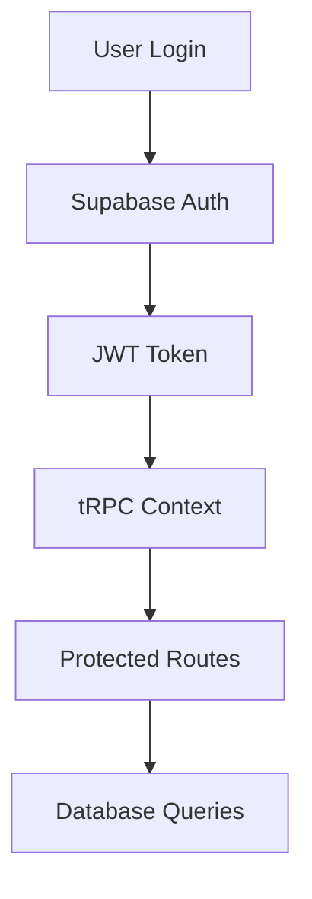

Init provides a complete authentication system built on Supabase Auth. This guide covers the authentication architecture, implementation details, and how to customize it for your needs.

## Overview

Supabase Auth handles all authentication concerns including:

- **User registration and login**
- **Email verification**
- **Password reset flows**
- **Social OAuth providers**
- **Session management**
- **Multi-factor authentication (MFA)**
- **Team-based access control**

## Architecture

### Authentication Flow



### Key Components

1. **Supabase Clients** - Different clients for server/browser/middleware
2. **tRPC Integration** - Authentication context for API calls
3. **Middleware** - Route protection and session management
4. **Auth Forms** - Login, register, and password reset components

## Supabase Client Configuration

Init uses multiple Supabase clients optimized for different environments:

### Server Client

For server-side operations (API routes, middleware):

```typescript
// packages/db/src/supabase-server-client.ts
import { cookies } from "next/headers";
import { createServerClient } from "@supabase/ssr";

export const getSupabaseServerClient = () => {
  return createServerClient(
    process.env.NEXT_PUBLIC_SUPABASE_URL!,
    process.env.NEXT_PUBLIC_SUPABASE_ANON_KEY!,
    {
      cookies: {
        getAll: async () => {
          const cookieStore = await cookies();
          return cookieStore.getAll();
        },
        setAll: async (cookiesToSet) => {
          const cookieStore = await cookies();
          cookiesToSet.forEach(({ name, value, options }) => cookieStore.set(name, value, options));
        },
      },
    },
  );
};
```

### Browser Client

For client-side operations:

```typescript
// packages/db/src/supabase-browser-client.ts
import { createBrowserClient } from "@supabase/ssr";

export const getSupabaseBrowserClient = () => {
  return createBrowserClient(
    process.env.NEXT_PUBLIC_SUPABASE_URL!,
    process.env.NEXT_PUBLIC_SUPABASE_ANON_KEY!,
  );
};
```

### Middleware Client

For Next.js middleware:

```typescript
// packages/db/src/supabase-middleware-client.ts
import { NextResponse } from "next/server";
import { createServerClient } from "@supabase/ssr";

export const getSupabaseMiddlewareClient = (request: NextRequest) => {
  let response = NextResponse.next({
    request: { headers: request.headers },
  });

  const supabase = createServerClient(
    process.env.NEXT_PUBLIC_SUPABASE_URL!,
    process.env.NEXT_PUBLIC_SUPABASE_ANON_KEY!,
    {
      cookies: {
        get: (name) => request.cookies.get(name)?.value,
        set: (name, value, options) => {
          request.cookies.set({ name, value, ...options });
          response.cookies.set({ name, value, ...options });
        },
        remove: (name, options) => {
          request.cookies.set({ name, value: "", ...options });
          response.cookies.set({ name, value: "", ...options });
        },
      },
    },
  );

  return { supabase, response };
};
```

## tRPC Integration

Authentication is deeply integrated with tRPC for type-safe API access:

### Context Setup

```typescript
// packages/api/src/trpc.ts
export const createTRPCContext = async (opts: { headers: Headers }) => {
  const supabase = getSupabaseServerClient();

  // Handle both header tokens (mobile) and cookies (web)
  const token = opts.headers.get("authorization");
  const { data } = token ? await supabase.auth.getUser(token) : await supabase.auth.getUser();

  return {
    headers: opts.headers,
    user: data.user, // Current authenticated user
    supabase, // Supabase client
    db, // Database client
  };
};
```

### Protected Procedures

```typescript
// packages/api/src/trpc.ts
export const protectedProcedure = t.procedure.use(
  t.middleware(({ ctx, next }) => {
    if (!ctx.user) {
      throw new TRPCError({ code: "UNAUTHORIZED" });
    }
    return next({
      ctx: {
        // Infers the `user` as non-nullable
        user: ctx.user,
        ...ctx,
      },
    });
  }),
);
```

## Authentication Routes

### Login

Email/password authentication:

```typescript
// packages/api/src/auth/auth-router.ts
export const authRouter = createTRPCRouter({
  signInWithPassword: publicProcedure
    .input(signInWithPasswordInput)
    .mutation(async ({ input, ctx }) => {
      const { data, error } = await ctx.supabase.auth.signInWithPassword({
        email: input.email,
        password: input.password,
      });

      if (error) {
        throw new TRPCError({
          code: "UNAUTHORIZED",
          message: error.message,
        });
      }

      return data;
    }),
});
```

### Registration

User registration with profile creation:

```typescript
signUp: publicProcedure
  .input(signUpInput)
  .mutation(async ({ input, ctx }) => {
    const { email, password, firstName, lastName } = input;

    const { data, error } = await ctx.supabase.auth.signUp({
      email,
      password,
      options: {
        data: {
          first_name: firstName,
          last_name: lastName,
          full_name: `${firstName} ${lastName}`,
        },
      },
    });

    if (error) {
      throw new TRPCError({
        code: "BAD_REQUEST",
        message: error.message,
      });
    }

    return data;
  }),
```

### OAuth Providers

Social authentication support:

```typescript
signInWithOAuth: publicProcedure
  .input(signInWithOAuthInput)
  .mutation(async ({ input, ctx }) => {
    const { provider, redirectTo } = input;

    const { data, error } = await ctx.supabase.auth.signInWithOAuth({
      provider,
      options: {
        redirectTo,
      },
    });

    if (error) {
      throw new TRPCError({
        code: "BAD_REQUEST",
        message: error.message,
      });
    }

    return data;
  }),
```

## Frontend Components

### Auth Form

Reusable authentication form component:

```typescript
// apps/web/src/app/(auth)/_components/auth-form.tsx
"use client";

import { useState } from "react";
import { useRouter } from "next/navigation";
import { Button, Input, Label } from "@repo/ui";
import { api } from "@/trpc/react";

interface AuthFormProps {
  type: "login" | "register";
}

export function AuthForm({ type }: AuthFormProps) {
  const [email, setEmail] = useState("");
  const [password, setPassword] = useState("");
  const [loading, setLoading] = useState(false);

  const router = useRouter();

  const signIn = api.auth.signInWithPassword.useMutation({
    onSuccess: () => router.push("/dashboard"),
    onError: (error) => toast.error(error.message),
  });

  const signUp = api.auth.signUp.useMutation({
    onSuccess: () => router.push("/auth/verify"),
    onError: (error) => toast.error(error.message),
  });

  const handleSubmit = async (e: React.FormEvent) => {
    e.preventDefault();
    setLoading(true);

    try {
      if (type === "login") {
        await signIn.mutateAsync({ email, password });
      } else {
        await signUp.mutateAsync({ email, password, firstName, lastName });
      }
    } finally {
      setLoading(false);
    }
  };

  return (
    <form onSubmit={handleSubmit} className="space-y-4">
      <div>
        <Label htmlFor="email">Email</Label>
        <Input
          id="email"
          type="email"
          value={email}
          onChange={(e) => setEmail(e.target.value)}
          required
        />
      </div>
      <div>
        <Label htmlFor="password">Password</Label>
        <Input
          id="password"
          type="password"
          value={password}
          onChange={(e) => setPassword(e.target.value)}
          required
        />
      </div>
      <Button type="submit" className="w-full" disabled={loading}>
        {loading ? "Loading..." : type === "login" ? "Sign In" : "Sign Up"}
      </Button>
    </form>
  );
}
```

## Route Protection

### Middleware Protection

Protect routes at the middleware level:

```typescript
// apps/web/src/middleware.ts
import type { NextRequest } from "next/server";
import { NextResponse } from "next/server";
import { getSupabaseMiddlewareClient } from "@repo/db/supabase-middleware-client";

export async function middleware(request: NextRequest) {
  const { supabase, response } = getSupabaseMiddlewareClient(request);
  const {
    data: { user },
  } = await supabase.auth.getUser();

  // Protected routes
  const protectedPaths = ["/dashboard", "/account"];
  const isProtectedPath = protectedPaths.some((path) => request.nextUrl.pathname.startsWith(path));

  if (isProtectedPath && !user) {
    const redirectUrl = new URL("/auth/login", request.url);
    redirectUrl.searchParams.set("redirectedFrom", request.nextUrl.pathname);
    return NextResponse.redirect(redirectUrl);
  }

  // Redirect authenticated users from auth pages
  const authPaths = ["/auth/login", "/auth/register"];
  const isAuthPath = authPaths.includes(request.nextUrl.pathname);

  if (isAuthPath && user) {
    return NextResponse.redirect(new URL("/dashboard", request.url));
  }

  return response;
}

export const config = {
  matcher: ["/((?!_next/static|_next/image|favicon.ico|.*\\.(?:svg|png|jpg|jpeg|gif|webp)$).*)"],
};
```

### Component-Level Protection

Protect components with auth checks:

```typescript
// components/auth-guard.tsx
"use client";

import { useEffect } from "react";
import { useRouter } from "next/navigation";
import { api } from "@/trpc/react";

interface AuthGuardProps {
  children: React.ReactNode;
  fallback?: React.ReactNode;
}

export function AuthGuard({ children, fallback }: AuthGuardProps) {
  const router = useRouter();
  const { data: workspace, isLoading } = api.auth.workspace.useQuery();

  useEffect(() => {
    if (!isLoading && !workspace?.user) {
      router.push("/auth/login");
    }
  }, [workspace, isLoading, router]);

  if (isLoading) {
    return <div>Loading...</div>;
  }

  if (!workspace?.user) {
    return fallback || null;
  }

  return <>{children}</>;
}
```

## Team-Based Access Control

### Team Membership

Init includes team-based access control:

```typescript
// Database schema (packages/db/src/schema.ts)
export const teams = pgTable("teams", {
  id: uuid("id").primaryKey().defaultRandom(),
  name: text("name").notNull(),
  slug: text("slug").notNull().unique(),
  createdAt: timestamp("created_at").defaultNow(),
});

export const teamMembers = pgTable("team_members", {
  id: uuid("id").primaryKey().defaultRandom(),
  teamId: uuid("team_id")
    .references(() => teams.id)
    .notNull(),
  userId: uuid("user_id").notNull(),
  role: text("role", { enum: ["OWNER", "ADMIN", "MEMBER"] }).notNull(),
  createdAt: timestamp("created_at").defaultNow(),
});
```

### Team Context

Get user's team memberships:

```typescript
// packages/api/src/auth/auth-router.ts
workspace: publicProcedure.query(async ({ ctx }) => {
  const teamMembers = ctx.user
    ? await ctx.db.query.teamMembers.findMany({
        where: eq(teamMembers.userId, ctx.user.id),
        with: { team: true },
      })
    : [];

  return {
    user: ctx.user,
    teams: teamMembers.map(tm => tm.team),
    activeTeam: teamMembers[0]?.team, // Default to first team
  };
}),
```

## Password Reset Flow

### Request Reset

```typescript
requestPasswordReset: publicProcedure
  .input(requestPasswordResetInput)
  .mutation(async ({ input, ctx }) => {
    const { data, error } = await ctx.supabase.auth.resetPasswordForEmail(
      input.email,
      {
        redirectTo: `${input.redirectTo}/auth/password-update`,
      }
    );

    if (error) {
      throw new TRPCError({
        code: "BAD_REQUEST",
        message: error.message,
      });
    }

    return data;
  }),
```

### Update Password

```typescript
updatePassword: publicProcedure
  .input(updatePasswordInput)
  .mutation(async ({ input, ctx }) => {
    const { data, error } = await ctx.supabase.auth.updateUser({
      password: input.password,
    });

    if (error) {
      throw new TRPCError({
        code: "BAD_REQUEST",
        message: error.message,
      });
    }

    return data;
  }),
```

## Session Management

### Client-Side Session

```typescript
// hooks/use-auth.ts
"use client";

import { api } from "@/trpc/react";

export function useAuth() {
  const { data: workspace, isLoading } = api.auth.workspace.useQuery();

  return {
    user: workspace?.user,
    teams: workspace?.teams || [],
    isLoading,
    isAuthenticated: !!workspace?.user,
  };
}
```

### Server-Side Session

```typescript
// In server components
import { getSupabaseServerClient } from "@repo/db/supabase-server-client";

export default async function DashboardPage() {
  const supabase = getSupabaseServerClient();
  const { data: { user } } = await supabase.auth.getUser();

  if (!user) {
    redirect("/auth/login");
  }

  return <div>Welcome {user.email}</div>;
}
```

## Environment Variables

Required environment variables:

```
# Supabase Configuration
NEXT_PUBLIC_SUPABASE_URL=your-supabase-project-url
NEXT_PUBLIC_SUPABASE_ANON_KEY=your-supabase-anon-key
SUPABASE_SERVICE_ROLE_KEY=your-service-role-key

# Database
DATABASE_URL=your-database-connection-string
```

## Customization

### Adding OAuth Providers

Configure providers in Supabase dashboard, then use:

```typescript
const signInWithGoogle = api.auth.signInWithOAuth.useMutation();

const handleGoogleLogin = () => {
  signInWithGoogle.mutate({
    provider: "google",
    redirectTo: window.location.origin + "/dashboard",
  });
};
```

### Custom User Metadata

Store additional user data:

```typescript
// During registration
const { data, error } = await supabase.auth.signUp({
  email,
  password,
  options: {
    data: {
      first_name: firstName,
      last_name: lastName,
      company: companyName,
      role: userRole,
    },
  },
});
```

### Multi-Factor Authentication

Enable MFA in Supabase dashboard:

```typescript
// Enable MFA for user
const { data, error } = await supabase.auth.mfa.enroll({
  factorType: "totp",
});

// Verify MFA challenge
const { data, error } = await supabase.auth.mfa.verify({
  factorId: data.id,
  challengeId: challenge.id,
  code: userEnteredCode,
});
```

## Security Best Practices

### 1. Environment Security

- Never commit secrets to version control
- Use different keys for development/production
- Rotate keys regularly

### 2. Session Security

- Configure appropriate session timeouts
- Use secure cookies in production
- Implement proper logout flows

### 3. Input Validation

- Validate all inputs with Zod schemas
- Sanitize user data
- Use parameterized queries

### 4. Route Protection

- Protect sensitive routes with middleware
- Implement proper role-based access
- Use server-side session validation

## Next Steps

Now that you understand authentication:

1. **Database setup** - Learn about [database architecture](/docs/architecture/database)
2. **Team management** - Implement team-based features
3. **User profiles** - Build user profile management
4. **Social auth** - Add OAuth providers
