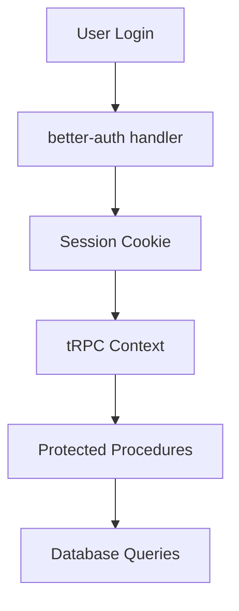

Init uses [better-auth](https://better-auth.com) with the Drizzle adapter. One config file drives web and mobile.

## Overview

better-auth handles:

- **Email/password** sign up and login
- **GitHub OAuth** social login
- **Session management** via cookies (web) and SecureStore (mobile)
- **Organizations** - every user gets a personal org, invites and roles included
- **Admin** - user banning, impersonation, role management

## Architecture



### Key Components

1. **Server config** - `packages/api/src/auth/auth.ts` defines the whole auth system
2. **Route handler** - `apps/web/src/app/api/auth/[...all]/route.ts` mounts it
3. **Web client** - `apps/web/src/lib/auth-client.ts`
4. **Mobile client** - `apps/mobile/src/utils/auth.ts`

## Server Configuration

The auth instance lives in `packages/api/src/auth/auth.ts`:

```typescript
// packages/api/src/auth/auth.ts
export const auth = betterAuth({
  database: drizzleAdapter(db, {
    provider: "pg",
  }),
  baseURL: baseUrl,
  plugins: [
    oAuthProxy({
      currentURL: baseUrl,
      productionURL: process.env.VERCEL_PROJECT_PRODUCTION_URL
        ? `https://${process.env.VERCEL_PROJECT_PRODUCTION_URL}`
        : baseUrl,
    }),
    expo(), // mobile support
    organization(), // multi-tenant orgs
    admin(), // user management
    nextCookies(), // Next.js cookie handling
  ],
  emailAndPassword: {
    enabled: true,
  },
  socialProviders: {
    github: {
      clientId: process.env.GITHUB_CLIENT_ID ?? "",
      clientSecret: process.env.GITHUB_CLIENT_SECRET ?? "",
    },
  },
  trustedOrigins: ["expo://"],
});
```

Notes:

- `oAuthProxy` makes GitHub OAuth work on Vercel preview deployments - callbacks route through the production URL.
- `nextCookies` sets session cookies from server actions and route handlers.
- The secret comes from `BETTER_AUTH_SECRET` (auto-detected by better-auth).

### Route Handler

All auth endpoints mount under `/api/auth/*`:

```typescript
// apps/web/src/app/api/auth/[...all]/route.ts
import { auth } from "@repo/api/auth/auth";

export const GET = auth.handler;
export const POST = auth.handler;
```

### Database Hooks

New users get a personal organization automatically. New sessions get an active organization:

```typescript
databaseHooks: {
  user: {
    create: {
      after: async (user) => {
        await createDefaultOrganization(user);
      },
    },
  },
  session: {
    create: {
      before: async (session) => {
        return await setActiveOrganization(session);
      },
    },
  },
},
```

## Server-Side Session

`auth.ts` exports cached helpers for server components:

```typescript
// Cached per-request with React cache()
export const getSession = cache(async () => auth.api.getSession({ headers: await headers() }));

export const getOrganization = cache(async (query) =>
  auth.api.getFullOrganization({ query, headers: await headers() }),
);
```

Usage in a server component:

```typescript
import { getSession } from "@repo/api/auth/auth";

export default async function DashboardPage() {
  const session = await getSession();

  if (!session) {
    redirect("/auth/login");
  }

  return <div>Welcome {session.user.email}</div>;
}
```

## tRPC Integration

The tRPC context resolves the session from request headers:

```typescript
// packages/api/src/trpc.ts
export const createTRPCContext = async (opts: { headers: Headers }) => {
  const session = await auth.api.getSession({
    headers: opts.headers,
  });

  return {
    session,
    db,
  };
};
```

`protectedProcedure` guarantees a logged-in user:

```typescript
export const protectedProcedure = t.procedure.use(({ ctx, next }) => {
  if (!ctx.session?.user) {
    throw new TRPCError({
      code: "UNAUTHORIZED",
      message: "You must be logged in to access this resource",
    });
  }
  return next({
    ctx: {
      // infers the `session` as non-nullable
      session: { ...ctx.session, user: ctx.session.user },
    },
  });
});
```

Organization membership is checked per-router - see `ensureOrganizationAccess` in `packages/api/src/todo/todo-router.ts`.

## Client Usage

### Web

```typescript
// apps/web/src/lib/auth-client.ts
import { adminClient, organizationClient } from "better-auth/client/plugins";
import { createAuthClient } from "better-auth/react";

export const authClient = createAuthClient({
  plugins: [adminClient(), organizationClient()],
});
```

Sign in, sign up, and OAuth from any client component:

```typescript
import { authClient } from "@/lib/auth-client";

// Email/password
await authClient.signIn.email({ email, password });
await authClient.signUp.email({ email, password, name });

// GitHub OAuth
await authClient.signIn.social({ provider: "github", callbackURL: "/dashboard" });

// Session hook
const { data: session } = authClient.useSession();
```

The auth pages live in `apps/web/src/app/(auth)/` - login, register, password reset. The shared form is `apps/web/src/app/(auth)/_components/auth-form.tsx`.

### Mobile

The Expo client stores sessions in SecureStore:

```typescript
// apps/mobile/src/utils/auth.ts
import * as SecureStore from "expo-secure-store";
import { expoClient } from "@better-auth/expo/client";
import { createAuthClient } from "better-auth/react";

export const authClient = createAuthClient({
  baseURL: getBaseUrl(),
  plugins: [
    expoClient({
      scheme: "expo",
      storagePrefix: "expo",
      storage: SecureStore,
    }),
  ],
});
```

## Environment Variables

```
# Generate with `openssl rand -base64 32`
BETTER_AUTH_SECRET=your-secret

# GitHub OAuth app (https://github.com/settings/developers)
GITHUB_CLIENT_ID=your-client-id
GITHUB_CLIENT_SECRET=your-client-secret
```

## Customization

### Adding OAuth Providers

Add to `socialProviders` in `packages/api/src/auth/auth.ts`:

```typescript
socialProviders: {
  github: { ... },
  google: {
    clientId: process.env.GOOGLE_CLIENT_ID ?? "",
    clientSecret: process.env.GOOGLE_CLIENT_SECRET ?? "",
  },
},
```

Then call `authClient.signIn.social({ provider: "google" })`.

### Schema Changes

Auth tables are generated. After changing plugins, regenerate:

```bash
cd packages/db && pnpm generate:auth-schema
```

Then re-add `.enableRLS()` to each table (see the note in `packages/db/src/drizzle-schema-auth.ts`) and run `pnpm db:push`.

## Security Notes

- Validate all inputs with Zod at tRPC boundaries
- Authorization lives in tRPC procedures, not the database - always check org membership in routers
- Never commit secrets; use different GitHub OAuth apps for dev and prod

## Next Steps

1. **Database setup** - Learn about [database architecture](/docs/architecture/database)
2. **API development** - Build [tRPC procedures](/docs/architecture/api)
3. **Social auth** - Add more OAuth providers
