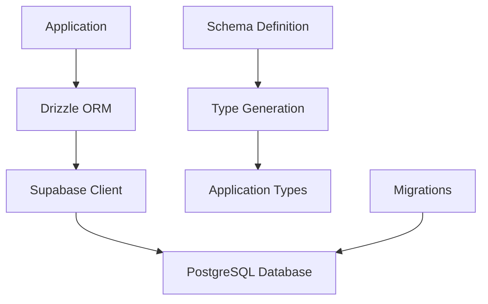

Init uses Supabase (PostgreSQL) as the database with Drizzle ORM for type-safe queries. This guide covers the database setup, schema design, and development patterns.

## Overview

The database stack combines:

- **Supabase** - Managed PostgreSQL with real-time features
- **Drizzle ORM** - Type-safe database queries and migrations
- **Multiple clients** - Optimized for server, browser, and middleware contexts
- **Automatic types** - Generated TypeScript types from schema

## Architecture



## Database Schema

Init includes a comprehensive schema for SaaS applications:

### Core Tables

```typescript
// packages/db/src/schema.ts

// Authentication (Supabase Auth schema)
const auth = pgSchema("auth");
export const authUsers = auth.table("users", (t) => ({
  id: t.uuid().primaryKey().notNull(),
  email: t.varchar({ length: 255 }),
  rawUserMetaData: t.jsonb(),
}));

// Teams
export const teams = pgTable("teams", (t) => ({
  id: t.uuid().notNull().primaryKey().defaultRandom(),
  name: t.varchar({ length: 255 }).notNull(),
  avatarUrl: t.text(),
  slug: t.text().unique().notNull(),
  stripeCustomerId: t.text().unique(),
  stripeSubscriptionId: t.text().unique(),
  planName: t.varchar({ length: 50 }),
  subscriptionStatus: t.varchar({ length: 20 }),
  createdAt: t.timestamp({ withTimezone: true }).defaultNow().notNull(),
  updatedAt: t.timestamp({ withTimezone: true }).defaultNow().notNull(),
}));

// Team Members
export const teamMembers = pgTable("team_members", (t) => ({
  id: t.uuid().notNull().primaryKey().defaultRandom(),
  teamId: t
    .uuid()
    .notNull()
    .references(() => teams.id, { onDelete: "cascade" }),
  userId: t.uuid().notNull(),
  role: t.varchar({ length: 20, enum: ["OWNER", "ADMIN", "MEMBER"] }).notNull(),
  createdAt: t.timestamp({ withTimezone: true }).defaultNow().notNull(),
}));

// Invitations
export const invitations = pgTable("invitations", (t) => ({
  id: t.uuid().notNull().primaryKey().defaultRandom(),
  teamId: t
    .uuid()
    .notNull()
    .references(() => teams.id, { onDelete: "cascade" }),
  email: t.varchar({ length: 255 }).notNull(),
  role: t.varchar({ length: 20, enum: ["ADMIN", "MEMBER"] }).notNull(),
  invitedBy: t.uuid().notNull(),
  token: t.text().notNull().unique(),
  acceptedAt: t.timestamp({ withTimezone: true }),
  createdAt: t.timestamp({ withTimezone: true }).defaultNow().notNull(),
  expiresAt: t.timestamp({ withTimezone: true }).notNull(),
}));

// Waitlist
export const waitlist = pgTable("waitlist", (t) => ({
  id: t.uuid().notNull().primaryKey().defaultRandom(),
  email: t.varchar({ length: 255 }).notNull().unique(),
  createdAt: t.timestamp({ withTimezone: true }).defaultNow().notNull(),
}));
```

### Relations

Drizzle relations define how tables connect:

```typescript
// Team relations
export const teamsRelations = relations(teams, ({ many }) => ({
  teamMembers: many(teamMembers),
  invitations: many(invitations),
}));

// Team member relations
export const teamMembersRelations = relations(teamMembers, ({ one }) => ({
  team: one(teams, {
    fields: [teamMembers.teamId],
    references: [teams.id],
  }),
  user: one(authUsers, {
    fields: [teamMembers.userId],
    references: [authUsers.id],
  }),
}));

// User relations
export const usersRelations = relations(authUsers, ({ many }) => ({
  teamMembers: many(teamMembers),
  invitationsSent: many(invitations),
}));
```

## Drizzle ORM Setup

### Database Client

```typescript
// packages/db/src/drizzle-client.ts
import { drizzle } from "drizzle-orm/postgres-js";
import postgres from "postgres";

import * as schema from "./schema";

const connectionString = process.env.DATABASE_URL!;

// Disable prefetch as it's not supported for "Transaction" pool mode
export const client = postgres(connectionString, { prepare: false });
export const db = drizzle(client, { schema });

export type Database = typeof db;
```

### Configuration

```typescript
// packages/db/drizzle.config.ts
import { defineConfig } from "drizzle-kit";

export default defineConfig({
  schema: "./src/schema.ts",
  out: "./supabase/migrations",
  dialect: "postgresql",
  dbCredentials: {
    url: process.env.DATABASE_URL!,
  },
  schemaFilter: ["public"],
});
```

## Database Operations

### Basic Queries

```typescript
// Select all teams
const teams = await db.select().from(teams);

// Select with conditions
const activeTeams = await db.select().from(teams).where(eq(teams.subscriptionStatus, "active"));

// Select with relations
const teamsWithMembers = await db.query.teams.findMany({
  with: {
    teamMembers: {
      with: {
        user: true,
      },
    },
  },
});
```

### Insertions

```typescript
// Insert single record
const newTeam = await db
  .insert(teams)
  .values({
    name: "Acme Corp",
    slug: "acme-corp",
  })
  .returning();

// Insert multiple records
const newMembers = await db
  .insert(teamMembers)
  .values([
    { teamId: team.id, userId: user1.id, role: "OWNER" },
    { teamId: team.id, userId: user2.id, role: "MEMBER" },
  ])
  .returning();
```

### Updates

```typescript
// Update single field
await db.update(teams).set({ name: "New Team Name" }).where(eq(teams.id, teamId));

// Update multiple fields
await db
  .update(teams)
  .set({
    name: "Updated Name",
    updatedAt: new Date(),
  })
  .where(eq(teams.id, teamId));
```

### Deletions

```typescript
// Delete with condition
await db
  .delete(teamMembers)
  .where(and(eq(teamMembers.teamId, teamId), eq(teamMembers.userId, userId)));

// Cascade delete (handled by foreign key constraints)
await db.delete(teams).where(eq(teams.id, teamId));
```

### Transactions

```typescript
// Database transaction
const result = await db.transaction(async (tx) => {
  // Create team
  const [team] = await tx
    .insert(teams)
    .values({
      name: input.name,
      slug: input.slug,
    })
    .returning();

  // Add owner
  await tx.insert(teamMembers).values({
    teamId: team.id,
    userId: userId,
    role: "OWNER",
  });

  return team;
});
```

## Advanced Queries

### Joins

```typescript
// Manual join
const teamsWithOwners = await db
  .select({
    team: teams,
    owner: authUsers,
  })
  .from(teams)
  .innerJoin(teamMembers, eq(teams.id, teamMembers.teamId))
  .innerJoin(authUsers, eq(teamMembers.userId, authUsers.id))
  .where(eq(teamMembers.role, "OWNER"));
```

### Aggregations

```typescript
// Count members per team
const teamMemberCounts = await db
  .select({
    teamId: teamMembers.teamId,
    memberCount: count(teamMembers.id),
  })
  .from(teamMembers)
  .groupBy(teamMembers.teamId);
```

### Subqueries

```typescript
// Teams with more than 5 members
const largeTeams = await db
  .select()
  .from(teams)
  .where(
    inArray(
      teams.id,
      db
        .select({ teamId: teamMembers.teamId })
        .from(teamMembers)
        .groupBy(teamMembers.teamId)
        .having(gt(count(teamMembers.id), 5)),
    ),
  );
```

## Type Generation

Drizzle automatically generates types:

```typescript
// Infer types from schema
import type { InferInsertModel, InferSelectModel } from "drizzle-orm";

// Select types (what you get from database)
export type Team = InferSelectModel<typeof teams>;
export type TeamMember = InferSelectModel<typeof teamMembers>;

// Insert types (what you send to database)
export type NewTeam = InferInsertModel<typeof teams>;
export type NewTeamMember = InferInsertModel<typeof teamMembers>;

// Partial types for updates
export type TeamUpdate = Partial<NewTeam>;
```

## Migration Management

### Generate Migrations

```bash
# Generate migration from schema changes
pnpm db:generate

# Apply migrations to local database
pnpm db:push

# Apply migrations to remote database
pnpm db:push-remote
```

### Migration Files

Generated migrations are stored in `packages/db/supabase/migrations/`:

```sql
-- 0001_initial.sql
CREATE TABLE IF NOT EXISTS "teams" (
  "id" uuid PRIMARY KEY DEFAULT gen_random_uuid() NOT NULL,
  "name" varchar(255) NOT NULL,
  "slug" text UNIQUE NOT NULL,
  "created_at" timestamp with time zone DEFAULT now() NOT NULL
);

CREATE TABLE IF NOT EXISTS "team_members" (
  "id" uuid PRIMARY KEY DEFAULT gen_random_uuid() NOT NULL,
  "team_id" uuid NOT NULL,
  "user_id" uuid NOT NULL,
  "role" varchar(20) NOT NULL
);
```

## Supabase Integration

### Real-time Features

Enable real-time updates:

```typescript
// Enable real-time for table
await supabase
  .channel("teams")
  .on("postgres_changes", { event: "*", schema: "public", table: "teams" }, (payload) => {
    console.log("Team changed:", payload);
  })
  .subscribe();
```

### Row Level Security (RLS)

Implement security policies:

```sql
-- Enable RLS on teams table
ALTER TABLE teams ENABLE ROW LEVEL SECURITY;

-- Policy: Users can only see teams they're members of
CREATE POLICY "Users can view their teams" ON teams
  FOR SELECT USING (
    id IN (
      SELECT team_id FROM team_members
      WHERE user_id = auth.uid()
    )
  );

-- Policy: Only team owners can update teams
CREATE POLICY "Only owners can update teams" ON teams
  FOR UPDATE USING (
    id IN (
      SELECT team_id FROM team_members
      WHERE user_id = auth.uid() AND role = 'OWNER'
    )
  );
```

### Database Functions

Create stored procedures:

```sql
-- Function to get user's team count
CREATE OR REPLACE FUNCTION get_user_team_count(user_uuid UUID)
RETURNS INTEGER AS $$
BEGIN
  RETURN (
    SELECT COUNT(*)
    FROM team_members
    WHERE user_id = user_uuid
  );
END;
$$ LANGUAGE plpgsql SECURITY DEFINER;
```

## Best Practices

### 1. Type Safety

Always use generated types:

```typescript
// Good - uses generated types
const createTeam = async (data: NewTeam): Promise<Team> => {
  const [team] = await db.insert(teams).values(data).returning();
  return team;
};

// Bad - any types
const createTeam = async (data: any): Promise<any> => {
  return await db.insert(teams).values(data).returning();
};
```

### 2. Error Handling

Handle database errors gracefully:

```typescript
try {
  const team = await db.insert(teams).values(data).returning();
  return team[0];
} catch (error) {
  if (error.code === "23505") {
    // Unique constraint violation
    throw new Error("Team slug already exists");
  }
  throw error;
}
```

### 3. Query Optimization

Use relations for efficient queries:

```typescript
// Good - single query with relations
const teamWithMembers = await db.query.teams.findFirst({
  where: eq(teams.id, teamId),
  with: {
    teamMembers: {
      with: {
        user: true,
      },
    },
  },
});

// Bad - multiple queries (N+1 problem)
const team = await db.query.teams.findFirst({
  where: eq(teams.id, teamId),
});
const members = await db.select().from(teamMembers).where(eq(teamMembers.teamId, teamId));
```

### 4. Connection Management

Use connection pooling for production:

```typescript
// packages/db/src/drizzle-client.ts
const pool = postgres(connectionString, {
  max: 10, // Maximum connections
  idle_timeout: 20, // Close idle connections after 20s
  max_lifetime: 60 * 30, // Close connections after 30 minutes
});
```

### 5. Schema Organization

Keep schema organized by domain:

```typescript
// auth-schema.ts - Authentication related tables
// team-schema.ts - Team management tables
// billing-schema.ts - Billing and subscription tables
// content-schema.ts - User content tables
```

## Development Workflow

### 1. Schema Changes

```bash
# 1. Modify schema in packages/db/src/schema.ts
# 2. Generate migration
pnpm db:generate

# 3. Apply to local database
pnpm db:push

# 4. Test changes
pnpm dev

# 5. Apply to production (via CI/CD)
pnpm db:push-remote
```

### 2. Adding New Tables

```typescript
// 1. Define table schema
export const posts = pgTable("posts", (t) => ({
  id: t.uuid().primaryKey().defaultRandom(),
  title: t.varchar({ length: 255 }).notNull(),
  content: t.text(),
  authorId: t.uuid().notNull(),
  createdAt: t.timestamp({ withTimezone: true }).defaultNow(),
}));

// 2. Define relations
export const postsRelations = relations(posts, ({ one }) => ({
  author: one(authUsers, {
    fields: [posts.authorId],
    references: [authUsers.id],
  }),
}));

// 3. Add to user relations
export const usersRelations = relations(authUsers, ({ many }) => ({
  posts: many(posts), // Add this line
  teamMembers: many(teamMembers),
}));
```

### 3. Testing Queries

```typescript
// Create test data
const testTeam = await db
  .insert(teams)
  .values({
    name: "Test Team",
    slug: "test-team",
  })
  .returning();

// Test queries
const foundTeam = await db.query.teams.findFirst({
  where: eq(teams.slug, "test-team"),
});

console.log("Team created:", foundTeam);
```

## Troubleshooting

### Common Issues

**Connection errors**

```bash
# Check database URL
echo $DATABASE_URL

# Test connection
pnpm db:push
```

**Migration conflicts**

```bash
# Reset local database
pnpm db:reset

# Regenerate migrations
pnpm db:generate
```

**Type errors**

```bash
# Rebuild packages
pnpm build

# Check schema syntax
pnpm typecheck
```

**Performance issues**

- Add database indexes for frequently queried columns
- Use relations instead of manual joins
- Implement connection pooling
- Monitor query performance in Supabase dashboard

## Next Steps

Now that you understand the database architecture:

1. **Authentication** - Learn how [auth integrates with the database](/docs/architecture/authentication)
2. **API development** - Build [tRPC procedures](/docs/architecture/api) with database queries
3. **Real-time features** - Implement live updates with Supabase
4. **Performance optimization** - Add indexes and optimize queries
